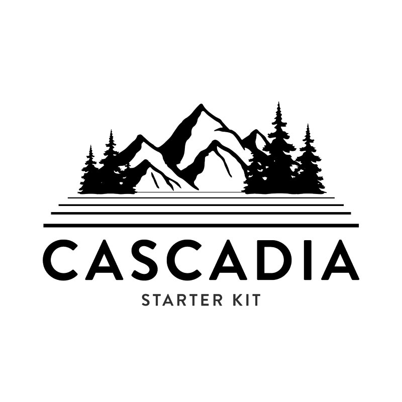

# Cascadia: A Starter Kit for Statamic

Cascadia is a mostly-unopinionated starter kit, with just enough CSS and JS to get you going with the essentials.

[See the demo](https://starter.cascadiadigital.dev/)



## Components
Cascadia comes with a bunch of Page Builder components with some sensible presets that you can customize to your liking. These include:
- Accordion
- Blog Teaser
- Logo Cloud
- CTA Bumper
- 50/50 Group
- Stats
- Testimonals / Ratings
- Large Media
- Google Map
- Hero
- Image Carousel
- Intro
- Tabs Explorer
- Job Listings

## Google Maps

To use the Google Maps component, be sure to add your API key as `GOOGLE_MAP_API_KEY` in your `.env` file.

## Sets
In addition, it has a few Sets built in that you can insert into any Bard field:
- Blockquote
- Image Carousel
- Tabbed Content

Cascadia leverages Alpine.js and TailwindCSS, such that you can configure the views to your liking. For the carousel, it includes [Splide](https://splidejs.com/)

## Navigation

Cascadia comes with 2 separate Navs out of the box, with the secondary nav being placed either in a smaller menu above the main nav, or in an off-canvas drawer, which can be configured in the Globals -> Site Config.

## Theming

Each page-builder component has a Theme Selector field, starting with the default (light), Accent, Muted, and Dark themes, for easy theming of components. Add more themes to the field, and set up the CSS in the `theme.css` file.

The theme system uses CSS variables to set up Tailwind classes like `bg-surface` which will change values, depending on the theme selected. Override these values to your liking in the CSS.

Classes for theming include:
- bg-surface
- text-body
- button (and variants)
- eyebrow

Explore the `theme.css` to see all the available theme classes, and add your own.

Update your `.env` file to see the theme images:
```
STATAMIC_CUSTOM_CMS_NAME="Cascadia Starter Kit"
STATAMIC_CUSTOM_LOGO_URL='/cascadia-kit.png'
STATAMIC_CUSTOM_DARK_LOGO_URL='/cascadia-logo.png'
```

## SEO

Basic SEO fields are incorporated into the Page, Team, and Blog collections, with fallbacks configured in the Globals: Site Config section.

## Analytics

Optionally choose between Fathom or GA with a toggle, and add your tracking ID to your `.env` file. The `button` component, used for CTA buttons throughout, will fire an event that can be used for sending data to your analytics platform of choice. Enable events by setting
```
enableEventTracking: true,
```

in the `js/apline/app.js` file.

To modify the available data, look at the `button` component, and explore the `app.js` file for the `handleAnalyticsEvent` method, and follow the code from there.

## Accessibility

This starter kit has baked-in accessibility features, including full keyboard operation for the accordion and Tab Explorer components, focus trap for the off-canvas menu.

Colour-contrast ratios for text over backrounds meet WCAG 2.1 AA standards. Keep this in mind when making updates to suit your own designs!
